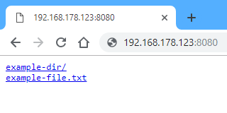

serve
=====

[](https://travis-ci.org/philippgille/serve/branches) [](https://ci.appveyor.com/project/philippgille/serve/branch/master) [](https://goreportcard.com/report/github.com/philippgille/serve) [](https://github.com/philippgille/serve/releases)

`serve` starts a simple temporary static file server in your current directory and prints your IP address to share with colleagues.

It's based on [a Gist](https://gist.github.com/paulmach/7271283/2a1116ca15e34ee23ac5a3a87e2a626451424993) by [Paul Mach](https://github.com/paulmach).

Contents
--------

- [Install](#install)
    - [Windows](#windows)
    - [macOS](#macos)
    - [Linux](#linux)
    - [Manually](#manually)
- [Docker](#docker)
- [Use](#use)
    - [Example](#example)
- [Build](#build)
    - [Packages](#packages)

Install
-------

We recommend installing `serve` with one of the following package managers, because they provide you with functionality such as automatic updates, instant availability as command in the `PATH`, easy removal, sandboxing etc.  
But alternatively you can always install `serve` manually as well, see [Manually](#manually).

### Windows

The easiest way is to use the package manager [Scoop](http://scoop.sh/):  
`scoop install serve`

Another option is [Chocolatey](https://chocolatey.org/):  
`choco install serve`

You can also have a look at the description in the Chocolatey Gallery on [https://chocolatey.org/packages/serve/](https://chocolatey.org/packages/serve/).

### macOS

The easiest way is to use the package manager [Homebrew](https://brew.sh/):  
`brew tap philippgille/tap`  
`brew install serve`

Or in a single command:  
`brew install philippgille/tap/serve`

### Linux

The easiest way is to use the package manager [Snap](https://snapcraft.io/), which is installed by default on Ubuntu 16.04 and later:  
`sudo snap install serve`

You can also have a look at the description in the Snap Store on [https://snapcraft.io/serve](https://snapcraft.io/serve).

> Note: Due to restrictions by Snap, `serve` can only serve files in the user's `$HOME` directory.

### Manually

#### With Go installed

`go get github.com/philippgille/serve`

> Note: Requires your `$GOPATH/bin` directory to be in your `PATH`, which is usually the case.

#### Without Go installed

You can download the binary for your OS from the [releases](https://github.com/philippgille/serve/releases) simply make it available as command in your `PATH`. See [Manual Installation](https://github.com/philippgille/serve/tree/master/docs#manual-installation) for details.

Docker
------

`serve` is also available as Docker image in the Docker Hub: [https://hub.docker.com/r/philippgille/serve/](https://hub.docker.com/r/philippgille/serve/)

To start the Docker container, just run:  
`docker run -v ${PWD}:/share --network "host" philippgille/serve`

`-d "/share"` is used as default flag, but you can overwrite it with any other flag. For all flags, see [Usage](#usage) below.

> Note: When using Docker on Windows or macOS, it probably runs in a VM (Hyper-V on Windows Pro, VirtualBox on Windows Home). This means that the network interfaces and their IP addresses aren't the ones of your host machine, but the ones of the VM. These are usually not reachable from other peers in the network your host machine is in. You have to either change the VMs configuration or set up port forwarding on your host machine.

Use
---

```bash
$ serve -h
Usage of serve:
  -a string
        Require basic authentication with the given credentials (e.g. -a "alice:secret")
  -d string
        The directory of static file to host (default ".")
  -h    Print the usage
  -p string
        Port to serve on (default "8100")
  -s    Serve via HTTPS instead of HTTP. Creates a temporary self-signed certificate for localhost, 127.0.0.1, <hostname>.local, <hostname>.lan, <hostname>.home and the determined LAN IP address
  -t    Test / dry run (just prints the interface table)
  -v    Print the version
```

Press `Ctrl+C` in the terminal to stop the server.

### Example

```bash
~/path/to/servable/files$ serve

Serving "." on all network interfaces (0.0.0.0) on HTTP port: 8100

Local network interfaces and their IP address so you can pass one to your colleagues:

      Interface      |  IPv4 Address   |              IPv6 Address
---------------------|-----------------|----------------------------------------
lo                   | 127.0.0.1       | ::1
eth0                 |                 | 
wlan0                | 192.168.178.123 | fe80::e7b:fdaf:ae5d:3cfa
virbr0               | 192.168.122.1   | 
br-8ef347e8a4e9      | 172.22.0.1      | fe80::42:c9ff:fed3:35a
docker_gwbridge      | 172.21.0.1      | 
docker0              | 172.17.0.1      | fe80::42:c6cf:fe3d:a554
veth0d522f4          |                 | fe80::307a:7fcf:fe3d:cba4

You probably want to share:
http://192.168.178.123:8100
```

When opening the URL `http://192.168.178.123:8100` in a browser you see the directory you're serving. For example:



Build
-----

To build `serve` by yourself:

1. [Install Go](https://golang.org/doc/install)
2. `cd` into the root directory of this repository
3. Execute: `go build`

> Note: The binaries in GitHub Releases are shrinked with additional Go linker flags and UPX

To also make `serve` available as command in other directories:

1. Add `$GOPATH/bin` to your `PATH` if you haven't done that already when installing Go
2. Execute: `go install`

There are also build scripts for Windows and Linux for creating release artifacts (shrinked binaries for Windows, macOS and Linux):

- Windows: `build/build.ps1`
- Linux: `build/build.sh`

> Note: They require Go and UPX to be installed

To build with a Docker container:

`docker run --rm -v ${PWD}:/go/src/github.com/philippgille/serve -w /go/src/github.com/philippgille/serve golang build/build.sh noupx`  
Or with UPX:  
`docker run --rm -v ${PWD}:/go/src/github.com/philippgille/serve -w /go/src/github.com/philippgille/serve golang bash -c "apt update && apt install -y upx-ucl && build/build.sh"`

### Packages

For Scoop and Homebrew no packages need to be built. They use "manifests"/"formulae" and the binaries from GitHub Releases.

For releasing a new version, they need to be updated here:

- Scoop: [https://github.com/lukesampson/scoop/blob/master/bucket/serve.json](https://github.com/lukesampson/scoop/blob/master/bucket/serve.json)
- Homebrew: [https://github.com/philippgille/homebrew-tap/blob/master/serve.rb](https://github.com/lukesampson/scoop/blob/master/bucket/serve.json)

For Snap a Git hook is set up in the Snapcraft dashboard to automatically build a new Snap on every commit, so for releasing a new version the file in *this* repository needs to be updated:

- Snap: [https://github.com/philippgille/serve/blob/master/snap/snapcraft.yaml](https://github.com/philippgille/serve/blob/master/snap/snapcraft.yaml)

The Snap package can also be built manually, for example with this script which utilizes Docker:

- Windows: `build\build-snap-with-docker.ps1`
- Linux: `build/build-snap-with-docker.sh`

The Chocolatey packages need to be uploaded manually to Chocolatey [here](https://chocolatey.org/packages/upload). The package can be built with this script:

- Windows: `build\build-chocolatey.ps1`

The Docker image can be built like this:

`docker build -f docker/Dockerfile -t philippgille/serve .`
